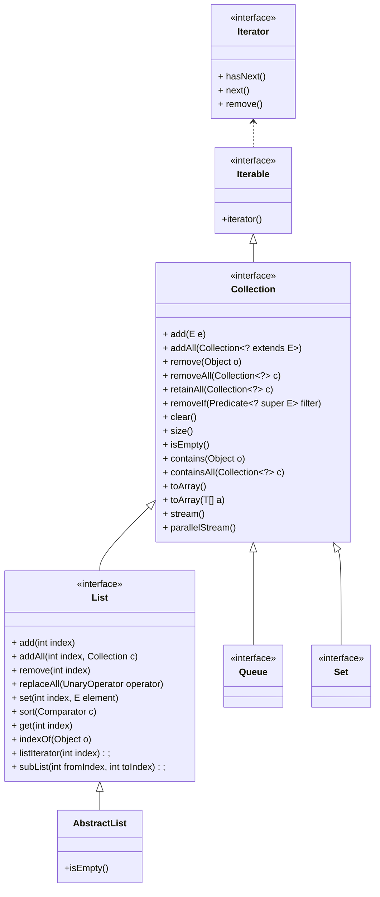

# Java Collection 详解

Java 的 Collection 接口定义位于 *java.util* 包下，与常用的集合类的关系如下：


## Iterable

作为 Collection 的父类，Iterable 接口定义了 **可遍历** 这一属性。其中的 `iterator()` 方法返回一个迭代器，迭代器类有两个方法，`hasNext` 判断是否到达遍历边界，`next` 获取下一个元素，因此，任何 Iterable 的实现都可以通过以下的方式遍历全部元素：
```java
for (Iterator<T> iterator = iterable.iterator(); iterator.hasNext(); ) {
    T element = iterator.next();
    process(T);
}
```
但上面的代码非常丑陋，它需要开发者感知迭代器对象 iterator，并且要知道迭代器对象的两个方法。如果误用方法，会导致错误，例如没有调用 `next` 方法可能导致死循环。因此 Java 为此提供了 `for (.. in ..)` 的语法糖，简化后的代码为：
```java
for (T element: iterable) {
    process(T);
}
```

## Collection

Collection 是用于存放元素的容器，作为容器必须提供“增删查”的功能(“改”的通常在键值对的数据结构中存在，例如 Map)。下面从“增删查”3种操作出发，分析一下 Collection 接口提供的功能。

### 增

#### add

如果向 Collection 中添加一个元素，只需要调用 `boolean add(E e)` 方法即可。官方的解释为：

> add 操作时是为了保证在函数执行返回后，Collection 中必存在指定的元素 e，如果 add 操作导致了集合的改变，那么返回 true，否则返回 false，例如 Set 类不允许重复元素，如果一个元素已经存在，则再 add 将返回 false。有的子类会对 add 操作进行限制，例如不能添加 null，或者只能添加特定类型的元素，如果是因为这种限制导致不能添加成功，应该抛出异常而不是返回 false，这种约定可以确保如果不抛异常，则指定元素必定在集合中。

add 操作抛出异常的建议为：
- *UnsupportedOperationException*: 子类不支持 add 操作；
- *ClassCastException*: 子类不接受待添加的元素类型；
- *NullPointerException*: 子类不接受添加 null 元素；
- *IllegalArgumentException*: 待添加元素的属性不符合要求；
- *IllegalStateException*: 集合当前时刻不允许添加元素；

下面的代码演示了调用 add 操作为 true 和 false，以及抛 NPE 的情况：
```java
@Test
public void testAdd() {
    Collection<Integer> collection = new TreeSet<Integer>();
    System.out.println(collection.add(1));  // true
    System.out.println(collection.add(1));  // false
    System.out.println(collection.add(null));  // throw NullPointerException
}
```

#### addAll

如果向 Collection 添加一批元素，调用 `boolean addAll(Collection<? extends E> c)`。

需要注意的有两点：如果在添加 c 的过程中，c 的内容改变了，结果未知；如果添加的是其自身，结果也未知。

如果 addAll 操作导致了集合的改变，则返回 true，否则返回 false。例如：
```java
@Test
public void testAddAll() {
    Collection<Integer> collection = new TreeSet<Integer>();
    collection.add(1);
    collection.add(2);
    System.out.println(collection.addAll(Arrays.asList(1,2)));  // false
    System.out.println(collection.addAll(Arrays.asList(2,3)));  // true
}
```

### 删

#### remove

remove 的过程与 add 相反，调用 `boolean remove(Object o)`，会从集合中找到一个与 o 相等的对象（如果存在），并将它从集合中移除。如果集合中存在多个对象与 o 相等，只移除一个。如果 remove 操作导致了集合的改变，返回 true，否则返回 false。例如下面的例子：
```java
@Test
public void testRemove() {
    Collection<String> collection = new ArrayList<String>();
    collection.add("a");
    collection.add("a");
    collection.add("b");
    System.out.println(collection.remove("a"));  // true
    System.out.println(collection);  // [a, b]
    System.out.println(collection.remove("c"));  // false
}
```

#### removeAll

`boolean removeAll(Collection<?> c)` 是 `remove` 的批量操作，会根据集合 c 中的元素，移除**所有**相等的元素。如果集合改变，返回 true，否则返回 false。

来看下面的一个例子：
```java
@Test
public void testRemoveAll() {
    Collection<String> collection = new ArrayList<String>();
    collection.add("a");
    collection.add("a");
    collection.add("a");
    collection.add("b");
    System.out.println(collection.removeAll(Arrays.asList("a")));  // true
    System.out.println(collection);  // [b]
    System.out.println(collection.removeAll(Arrays.asList("a")));  // false
}
```

#### retainAll

`boolean retainAll(Collection<?> c)` 与 `removeAll` 刚好相反，是保留 c 中出现的元素，移除其他元素。

例子如下：
```java
@Test
public void testRetainAll() {
    Collection<String> collection = new ArrayList<String>(
        Arrays.asList("a", "a", "a", "b"));
    System.out.println(collection.retainAll(Arrays.asList("b")));  // true
    System.out.println(collection);  // [b]
    System.out.println(collection.retainAll(Arrays.asList("b")));  // false
}
```

#### removeIf

`boolean removeIf(Predicate<? super E> filter)` 是 java 8 新加的一个方法，有默认的实现：
```java
default boolean removeIf(Predicate<? super E> filter) {
    Objects.requireNonNull(filter);
    boolean removed = false;
    final Iterator<E> each = iterator();
    while (each.hasNext()) {
        if (filter.test(each.next())) {
            each.remove();
            removed = true;
        }
    }
    return removed;
}
```
该方法传入的是一个谓语，判断集合中的元素是否满足谓语，如果满足，则删除。如果集合改变，返回 ture，否则返回 false。
若集合的迭代器不支持 remove 操作，将抛出 *UnsupportedOperationException* 异常。

下面是一个示例：
```java
@Test
public void testRemoveIf() {
    Collection<Integer> collection = new ArrayList<Integer>(Arrays.asList(1,2,3,4,5,6,7));
    System.out.println(collection.removeIf((v) -> v % 9 == 0));  // false
    System.out.println(collection.removeIf((v) -> v % 3 == 0));  // true
    System.out.println(collection.removeIf((v) -> v % 3 == 0));  // false
    System.out.println(collection);  // 1, 2, 4, 5, 7]
}
```

#### clear

`void clear()`：清空集合中的所有元素。

### 查

查询内容可以为集合中的元素，也可以查询集合的属性。

#### size

`int size()`: 查询集合中的元素数量。可以看到返回值为 int 类型，因此如果集合中的元素数量大于 *Integer.MAX_VALUE*，该函数将返回 Integer.MAX_VALUE。

#### isEmpty

`boolean isEmpty()`: 查询集合是否为空。

#### contains

`boolean contains(Object o)`: 判断集合中是否存在与对象 o 相等的元素。

#### containsAll

`boolean containsAll(Collection<?> c)`: 判断集合中是否存在所有 c 中出现的元素。

#### toArray

`Object[] toArray()` 和 `<T> T[] toArray(T[] a)` 是 toArray 函数的重载方法。

`Object[] toArray()` 方法返回的数组顺序必须与遍历集合的顺序一致。返回的数组是新创建的，因此调用方即使改变了该数组，也不会对集合产生变化。
但是，如果修改了数组中的元素，集合中的元素将会发生变化。例如下面的例子：
```java
@Test
public void testToArray1() {
    Collection<Pos> collection = new ArrayList<Pos>(Arrays.asList(new Pos(1,1),
            new Pos(2,2), new Pos(3, 3)));
    System.out.println(collection);  // [(1,1), (2,2), (3,3)]
    Object[] array = collection.toArray();  // 返回类型为 Object[]，需要强转
    array[1] = array[2];
    System.out.println(collection);  // [(1,1), (2,2), (3,3)]   改变数组不会导致集合改变
    ((Pos)array[0]).x = 10;
    System.out.println(collection);  // [(10,1), (2,2), (3,3)]  改变集合元素会导致集合改变，因为共用引用
}
```

`<T> T[] toArray(T[] a)` 也是获取集合中的元素，不过存放元素的数组 a 由调用方提供。
如果 a 的容量大于或等于集合元素个数，则存放在 a 中，并且在最后一个元素后面补 null。
如果 a 的容量小于集合元素个数，则由系统创建新数组。

例如：
```java
@Test
public void testToArray2() {
    Collection<String> collection = new ArrayList<>(Arrays.asList("a", "b", "c"));
    String[] a1 = new String[] {"1", "2", "3"};
    String[] b1 = collection.toArray(a1);
    System.out.println("a1 == b1 : " + (a1 == b1));  // a1 == b1 : true
    System.out.println(Arrays.toString(a1));  // [a, b, c]

    String[] a2 = new String[] {"1", "2", "3", "4", "5"};
    String[] b2 = collection.toArray(a2);
    System.out.println("a2 == b2 : " + (a2 == b2));  // a2 == b2 : true
    System.out.println(Arrays.toString(a2));  // [a, b, c, null, 5] , 第三个元素后补 null

    String[] a3 = new String[] {"1"};
    String[] b3 = collection.toArray(a3);
    System.out.println("a3 == b3 : " + (a3 == b3));  // a3 == b3 : false
    System.out.println(Arrays.toString(a3));  // [1] , a3 容量不足，重新创建新数组，原数组内容不变
    System.out.println(Arrays.toString(b3));  // [a, b, c]
}
```

#### stream && parallelStream

将集合转换为 stream(串行流) / parallelStream(并行流) 进行处理。


## List

### add

`boolean add(E e)` 默认将元素加在队列的末尾。

